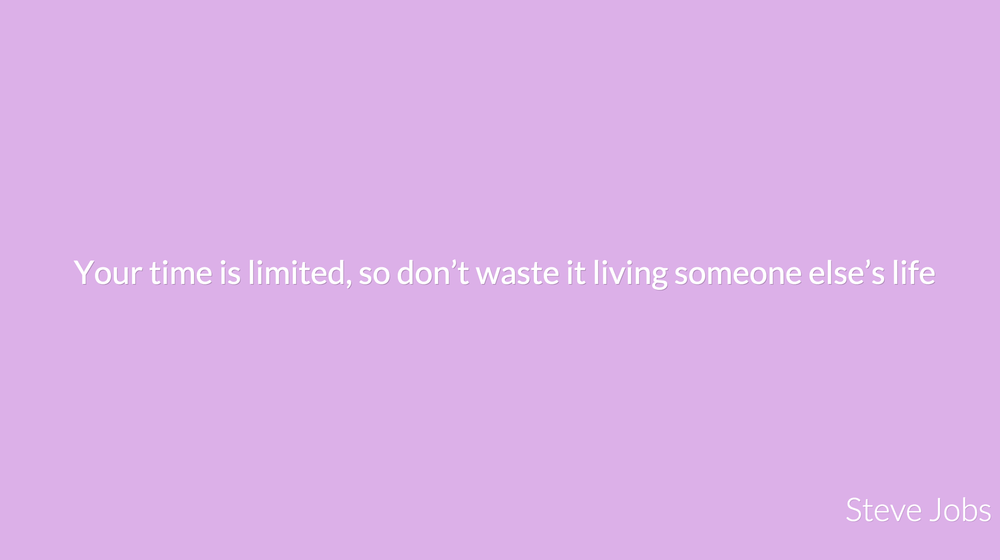

# Assignment 1

## Objective

Demonstrait your mastery of:

- running nodejs
- setting up a mongodb database
- connecting to the database
- responding with a file
- responding with JSON
- node module syntax (require/export) using the module design pattern
- npm
- testing your code
- some html
- some css
- jquery or just javacript in the broweser
- ajax


## Requires

- Internet
- Google chrome
- A plain text editor (preferably sublime)
- mongodb
- nodejs
- git
- A github account

## Motivation

We feel SE students will go through harsh trials in the near future, accordingly we thought of having you build an inspirational quote app. May it lift your spirit in your time of need.

## Task

Your job is to create a simple test driven inspirational quotes application that will show you a new inspirational quote everytime you click on the page as well as the author of the quote in the bottom left, the quote should be loaded using ajax.

The application should inform the user somehow on how he can use it, in my case I made it so that the first time the app loads starts it says on the screen that you should click/tap


> If you want to have fun you can modify the data we give you and create your own set of quotes - for example make it an arabic movie quotes app.

### UI




### File structure

Your app should minimally have the following structure.

```
| |- public/
| |  |- index.html 
| |  |- 404.html 
| |
| |- test/
| |  |- quote.js
| |
| |- server.js
| |- quotes.js
| |- db.js            <------ this is an example of an optional file
| |- package.json
| |- quotes.json
| |- .gitignore
```

You will find in this repo the `.gitignore` and `quotes.json` files everything else you have to create yourself.

- `public/index.html` Should contain the html as well as the styles and javascript need to run the app.
- `server.js` contains code that runs the server and handles requests.
- `/quotes.js` should contain the functionality related to quotes
- `test/quotes.js` should contain the tests that make sure all functionality in the quotes.js file work.
- `db.js` In my example this is a file that hold functions for conencting and accessing the database.

### Features

- The app must serve the data from a mongodb database.
- The app should implement a simple GET API for getting quotes.
- The app should internally have functionality for adding updating and deleting quotes in addition to getting.

#### quotes.js

Quotes.js shoudl export the following functions

##### `getElementByIndexElseRandom(array [, index])` 

- Given an array returns:
    - A random element from the array If index is not passed.
    - The element in the correct index position if it is.

```
getElementByIndexElseRandom([1, 3, 4])    // any of 1 3 or 4
getElementByIndexElseRandom([1, 3, 4], 0) // always 1
```


##### `getQuotesFromJSON()`

- Will call the callback function passed __cb__ with arguments `error, quotes`
    - error will be null if no error occured
    - quotes is a list of all quotes
    
```
getQuotesFromDB(function (err, quotes) {
    // any of quote object in the database  
})
```

##### `getQuotesFromDB(cb)`

- Will call the callback function passed __cb__ with arguments `error, quotes`
    - error will be null if no error occured
    - quotes is a list of all quotes
    
```
getQuotesFromDB(function (err, quotes) {
    // any of quote object in the database  
})
```

##### `getQuoteFromJSON(index)`

- returns a random quote from the quotes.json file if index is not passed else the on int the index position.

```
getQuoteFromJSON()           // any of quote object in the quotes.json file
getQuoteFromJSON(0).author   // Kevin Kruse
```

##### `getQuoteFromDB(cb [, index])`

- Will call the callback function passed __cb__ with arguments `error, quote`
    - error will be null if no error occured
    - quote should contain a random quote document returned from the database
- Optional arguemtn index if present will select a sepcific quote by index from the quotes documents returned.

```
getQuoteFromDB(function (err, quote) {
    // any of quote object in the database  
})
getQuoteFromDB(function (err, quote) {
    quote.author  // is Kevin Kruse assuming it's the first document in the database
}, 0)
```

##### `seed(cb)`

populate the database with quotes from quotes.json, seed should call the call back when done with an `error, seeded` set of arguments.

seeded is a boolean value that is true if the database was empty (and thus seeded) or no error occured but the database already contains records.


##### `insertQuote(quote, cb)`

Insert a quote into the database and call `cb` returning  `error, quote` 

##### `deleteQuote(query, cb)`

Delete a quote from the database based on query and call `cb` when done


##### `updateQuote(query, quote, cb)`

Update quote in the database based on query with whatever is in quote calling `cb` when done.

> Note updateQuote will always update or add whatever is in quote never replace the whole document (which is the default update behavior)

#### db.js

##### `connect(cb)`
##### clearDb()
    clears the database used largely in testing.

#### API

The server needs to serve index.html when we visit `/index.html`, `index`, or just `/`. Any other url not suported should return the 404.html page

The following API endpoint shoudl exist

`/quote` returns a JSON response that was randomly selected froim the database
`/quotes` returns a JSON array as response containing all quotes.

- When a user clicks on the page on index.html; a script should send a `GET` request that follows the API descripted bellow returning a random quote form the database as JSON, which in tuen is then used to update the html page.

You need to write tests as well as run a coverage test suit

### Suggestions

You will need to add your dependencies in package.json

> The quote test should test all functioninstaled and even those rehected

